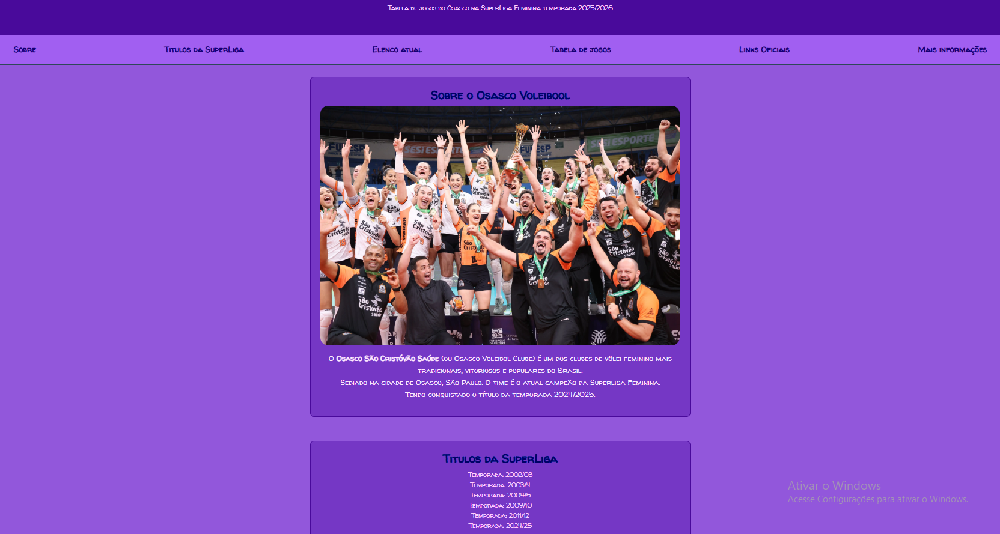

# 🏐 Tabela de Jogos - Osasco Voleibol

Este é um projeto de landing page estática, desenvolvido puramente com HTML e CSS, dedicado ao time de vôlei feminino Osasco São Cristóvão Saúde. A página apresenta informações atualizadas sobre a equipe, seu elenco para a temporada 2025/2026 e a tabela de jogos da SuperLiga.

## 🖥️ Visualização

## ✨ Funcionalidades

O site é uma página única (Single Page) e está dividido nas seguintes seções:

* **Sobre o Time:** Breve introdução sobre a história e importância do Osasco Voleibol.
* **Títulos da SuperLiga:** Uma lista com os anos em que o time foi campeão.
* **Elenco Atual:** Relação de jogadoras (levantadoras, opostas, ponteiras, centrais, líberos) e técnico da temporada 2025/2026.
* **Tabela de Jogos:** Uma tabela detalhada com os jogos da SuperLiga, incluindo datas, adversários, local, horário, transmissão e resultados.
* **Links Oficiais:** Links para as redes sociais (Instagram, Facebook, YouTube, TikTok) e o site oficial da SuperLiga.
* **Mais Informações:** Um formulário de contato (apenas front-end, sem funcionalidade de envio) para que os usuários possam solicitar mais informações.

## 🛠️ Tecnologias Utilizadas

Este projeto foi construído utilizando apenas tecnologias web fundamentais:

* **HTML5:** Para a estruturação semântica de todo o conteúdo (cabeçalho, navegação, seções, tabelas, listas e formulário).
* **CSS3:** Para a estilização completa da página, incluindo:
    * Importação da fonte customizada ("Walter Turncoat") do Google Fonts.
    * Estilização de cabeçalho, rodapé e barra de navegação.
    * Formatação de tabelas, listas e formulários.
    * Uso de seletores, classes e IDs para aplicar estilos específicos.
    * Efeitos `hover` para links.

## 🚀 Como Executar

Este é um projeto puramente front-end. Para visualizá-lo:

1.  Certifique-se de que os arquivos `index.html` (o seu HTML) e `style.css` (o seu CSS) estão na mesma pasta.
2.  Abra o arquivo `index.html` no seu navegador de preferência (Google Chrome, Firefox, Edge, etc.).

Não é necessária nenhuma instalação ou configuração adicional.

## 👤 Autor

Página desenvolvida por **Victor Mangabeira**.
